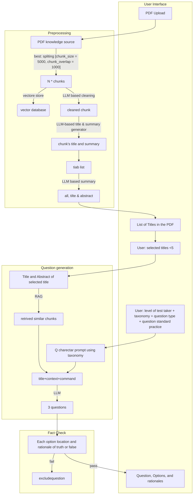

# Exminer
Creating MCQs from your PDFs by leveraging LLMs.

## About the Project
Exminer aims to ease the tedious process of test creation. It utilizes RAG-based LLMs to generate questions on the topics you specify from the PDFs you provide.

## What Can It Do Now?
+ Processes the PDF and saves it as chunks into a database.
+ Generates 5 MCQs based on the specified topic when a user enters a query.

## TO-DO
- [ ] Allow users to choose the number of questions.
- [ ] Enhance the pre-prompt to generate more relevant questions.
- [ ] Improve chunk saving based on topics for better indexing and question generation.
- [ ] Automatically extract PDF topics to offer users options to choose from different topics.

## Design

    
    
    

    
