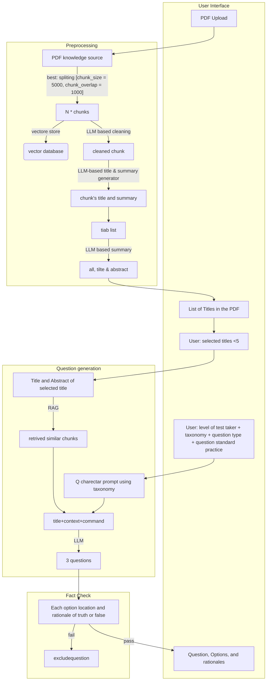

# Exminer
Creating MCQs from your PDFs by leveraging LLMs.

## About the Project
Exminer aims to ease the tedious process of test creation. It utilizes RAG-based LLMs to generate questions on the topics you specify from the PDFs you provide.

## What Can It Do Now?
+ Processes the PDF and saves it as chunks into a database.
+ Generates 5 MCQs based on the specified topic when a user enters a query.

## What It Can't Do, Intentionally?
+ Processing multiple PDFs
+ Processing very long PDFs
+ Getting questions outside of the topics in the PDF

## FAQ

### FAQ: Using the App
+ How can I use this on Windows?

+ How can I use this on a Mac system?
 
+ How can I use this on a Linux system?

+ What is the minimum system infrastructure for using this app?

+ How I can modify this app for my personal use case?

+ Can I create questions in a language other than English? How?

### FAQ: Price
+ Who will pay for the question?

+ How much would the ingestion of a 40-page PDF cost me?

+ How much generating one question set (three Qs) would cost me?

### FAQ: Method
+ How does this app work?

+ How reliable is the question?

## TO-DO
- [ ] Allow users to choose the number of questions.
- [ ] Enhance the pre-prompt to generate more relevant questions.
- [ ] Improve chunk saving based on topics for better indexing and question generation.
- [ ] Automatically extract PDF topics to offer users options to choose from different topics.

## Design

# Team
This project was developed by Seyed Amir Ahmad Safavi-Naini (Conceptualization, Funding (self-funded), help on Programming and Methodology), Nariman Naderi (Programming, Methodology, help on Conceptualization), and Soleyiman Ahmadi (Supervision and Validation). Feel free to reach SAA Safavi-Naini at sdamirsa@gmail.com if you need any modification on app for your own use or for improving the app. 
    

    
